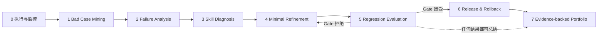

# Learn Self-Evolving Skills

你用约一天时间，亲手跑完一次 Skill 自进化闭环。最后你会拿走一段可回查证据的简历项目描述、面试追问准备、概念清单和完整证据索引。

> 这是经历生成器，不是证书课程。你会在 STATE-Bench 客服退货沙盒里运行真实模型；它不是生产流量，也不代表生产部署。

## 你最后拿到什么

下面是版式示例。`X/Y/Z` 是模板字段，不是预先写好的成绩；站 7 只会用你自己的 evidence JSON 填入真实数字。

> **基于 STATE-Bench 客服退货沙盒的 Skill 进化实战**
>
> 围绕 15 条可执行客服 case 建立真实模型执行、终态判分和失败回看链路；从基线 `X/15` 出发，完成人工归因、`Y` 轮最小修改与目标回放 + 全量回归 Gate，最终达到 `Z/15`，并记录 `pass→fail`、版本发布与回滚证据。

产物包包含：

- `resume-zh.md` + `resume-en.md`
- `interview-prep.md`
- `concepts.md`
- `evidence-facts.json` + `evidence-index.json`



## 三步开始

你需要 Python 3.11+、[`uv`](https://docs.astral.sh/uv/)、Claude Code 2.1.220、一个实验 Provider 的 API Key，以及你自己的 coding agent（Claude Code、Codex 或兼容 Agent Skills 的终端）。实验 Provider 可选 `siliconflow` 或 `chatanywhere`。

```bash
git clone https://github.com/TangWiki-Ai/learn-self-evolving-skills.git
cd learn-self-evolving-skills
uv sync --all-extras --locked
```

在你的 shell 环境里设置所选 Provider 对应的 Key。二选一即可。不要把 Key 粘进聊天，也不要把它写进仓库、命令参数、配置文件或任何产物。

```bash
export SILICONFLOW_API_KEY='你的 SiliconFlow Key'
# 或
export CHATANYWHERE_API_KEY='你的 ChatAnywhere Key'
```

如果你的网络必须经过代理，请在运行 Journey 前显式设置标准代理变量。课程只把这些变量传给隔离的 Claude Code 子进程；带凭据的代理 URL 也会按秘密脱敏。

```bash
export HTTPS_PROXY='http://127.0.0.1:你的代理端口'
export HTTP_PROXY="$HTTPS_PROXY"
export ALL_PROXY="$HTTPS_PROXY"
```

新建 live workspace 时，讲师运行第一条 station command 必须显式选择 Provider。你不必提前执行；它会运行下面两条命令之一：

```bash
uv run ses journey station 0 --provider siliconflow
# 或
uv run ses journey station 0 --provider chatanywhere
```

课程把选择写入本地 status。恢复已有 workspace 时沿用已保存的 Provider；不要静默切换，也不要因为另一个 Key 恰好存在就改用它。ChatAnywhere 路径只使用仓库锁定的 Claude 系列模型，不复用 SiliconFlow 的 DeepSeek/Qwen 模型锁。

打开 coding agent，然后说：

```text
开始学习
```

项目级讲师 Skill 位于 `.agents/skills/self-evolving-skill-instructor/`；Claude Code 通过 `.claude/skills/` 的轻量发现入口读取同一份正文。讲师会安装依赖、检查环境、启动只读 dashboard，并逐站代跑命令。

## 两笔账

| 费用 | 谁产生 | 这里如何处理 |
|---|---|---|
| 讲师 token | 你的 coding agent 订阅或 Key | 仓库无法可靠计量；请按你的服务方案查看 |
| 实验引擎 | Claude Code 经所选 Provider 运行 case | dashboard 按本地 status 展示 token 和成本来源 |

当前 README 不写未经实测的价格。`claude_code_estimate` 只是 Claude Code 的估算，不是 Provider 最终账单；`unavailable` 表示没有可靠成本；`synthetic_ci` 只用于 fixed CI，不能代表 live 成本。系统不因预算自动停止。

## 你实际做什么

引擎已经存在。你不用写 Python 管道。你会做三类真实判断：

1. 从失败列表里挑选要分析的 case。
2. 给失败做归因并定位 Skill 文本。
3. 写出最小修复，再根据回归证据决定收窄、保留或发版。

每站只有一类入口：

```bash
uv run ses journey station 0
uv run ses journey station 1
uv run ses journey station 2
uv run ses journey station 3
uv run ses journey station 4
uv run ses journey station 5
uv run ses journey station 6
uv run ses journey station 7
```

讲师会根据你的决定补上该站参数。你也可以手动查看帮助：

```bash
uv run ses journey --help
```

## Dashboard

```bash
uv run ses journey dashboard
```

dashboard 默认打开 `http://127.0.0.1:8765/`。它只读取 `.ses/status.json` 和状态里明确列出的产物；它不执行命令、不写文件、不读取 Key，也不访问外网。

你会在首页看到：

- 毕业产物样例
- 站 0–7 的实时进度
- 实验 Provider、模型锁、累计 token 与成本来源
- 每站报告、决定和最终产物链接

中断后不要删除 `.ses/`。再次说“开始学习”，讲师会从当前站恢复。Gate 未通过也不会挡住站 7；总结会如实写出当前状态。

## 八站地图

| 站 | 简历短语 | 你的判断 | 主要产物 |
|---|---|---|---|
| 0 | Execution & Monitoring | 观察，不下结论 | 15-case v0 baseline + `n=5` no-Skill 样本 |
| 1 | Bad Case Mining | 挑选失败 case | 失败清单 |
| 2 | Failure Analysis | 环境 / case / Skill 归因 | 归因分布 |
| 3 | Skill Diagnosis | 诊断标签与文件行号 | 诊断定位视图 |
| 4 | Minimal Refinement | 最小修复方案 | 候选快照 + diff |
| 5 | Regression Evaluation | 跟随 Gate、收窄或暂缓 | 两道 Gate 报告 |
| 6 | Version Release & Rollback | 发版、回滚演练或暂缓 | 版本时间线 |
| 7 | Evidence-backed Portfolio | 核对事实 | 简历 + 面试 + 概念 + 证据包 |

站 5 不看“净提升”蒙混过关。它先要求每个目标 case 变绿，再要求 v0 原先通过的 case 中 `pass→fail = 0`。如果现有 case 和 v0 没有暴露缺口，流程会如实记录“没有可立案失败”；它不会伪造一次教学性拒收。

## 证据与安全边界

- 学习者路径走真实 Claude Code + 你显式选择的 Provider。新 live workspace 必须传 `--provider siliconflow|chatanywhere`；`--mode fixed` 只供仓库 CI 使用。
- ChatAnywhere 只走锁定的 Claude 系列模型。2026-08-21 已按 [ChatAnywhere 的 Claude Code 配置](https://docs.chatanywhere.tech/) 完成 live doctor 的 Model + MCP 校验，并跑通一条原生 Skill + Shop + Judge 代表用例；你在自己的环境里仍应重跑 smoke。
- case 使用固定 STATE-Bench/ABCD/tau2 派生沙盒资料，不使用生产日志。
- State Judge 与 Rule Judge 检查工具顺序、精确参数和终态；模型不能自行宣布通过。
- 所有 Key 只从进程环境读取。课程在写入 JSON、HTML、Markdown、决策或候选前扫描凭据特征；一旦命中就拒绝落盘，错误信息不会回显 Key。
- dashboard 只允许 GET/HEAD，并拒绝目录穿越、symlink 逃逸和未列入状态的文件。
- 站 7 的数字来自 JSON，不经 LLM 改写。

## 当前交付状态

| 项目 | 状态 |
|---|---|
| 站 0–7 CLI、恢复状态、只读 dashboard | 已实现，fixed CI 全链路可验 |
| 15 条 v0 baseline + 固定五条 no-Skill 样本 | 已接入 |
| 两道 Gate、版本时间线、站 7 机器模板 | 已接入 |
| SiliconFlow / ChatAnywhere Provider 支持 | 已接入；ChatAnywhere live Model + MCP 与代表用例已实测 |
| Part B 生产对照正文与精选外链 | 待 Owner 最终审阅；讲师不会擅自补写 |

## 仓库结构

```text
.agents/skills/            项目级讲师 Skill 与分站 playbook
fixtures/seed/             v0、受测参考与 CI 种子资产
src/ses/                   评测、沙盒、进化、状态与 dashboard 引擎
tests/                     离线单元、集成、契约和安全测试
data/                      固定来源、case 与 manifest
docs/specs/                内部工程规格，不是学习入口
.ses/                      你的本地运行状态与证据（运行后生成）
```

旧的 `course/` 十课、starter、solution 和每课测试已经删除。Git 历史仍保留它们。

## 维护者检查

默认测试不访问网络，也不需要 Key：

```bash
uv sync --all-extras --locked
uv run ruff format --check .
uv run ruff check .
uv run mypy src tests
uv run pytest
```

真实 smoke 只在你显式选择 Provider、设置匹配的 `SILICONFLOW_API_KEY` 或 `CHATANYWHERE_API_KEY`，并运行 learner command 时发生。ChatAnywhere 的维护者 smoke 命令如下；它验证 Model + MCP，并让一条代表 case 走完 Skill、Shop、State/Rule Judge。代表 case 可以得到 `pass` 或课程需要诊断的 `agent_fail`，但基础设施、Simulator 或 Judge 错误都会让测试失败。

```bash
SES_RUN_LIVE=1 \
SES_LIVE_PROVIDER=chatanywhere \
SES_LIVE_CONFIG="$PWD/ses.json" \
uv run pytest tests/engines/test_live.py -q -s
```

不要在 CI 里把 fixed 数字宣传成 live 成绩；没有 live doctor 证据时，也不要把“代码已接入”写成“真实链路已通过”。

## License

代码使用 [Apache-2.0](LICENSE)。上游数据保留各自的许可证与来源记录。
