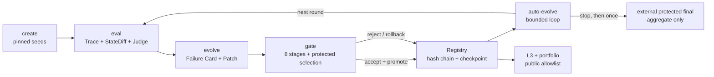

# learn-self-evolving-skills

这是一门用可重放评测、证据化 Patch、八阶段 Gate、Registry 和有界自动循环实现 Skill
自进化的 Python 工程课程。

它适合要学习 Agent 评测、Skill 迭代、数据隔离和发布治理的开发者，也适合需要审计这些
机制的课程维护者。十课的 fixed/offline 路径已经实现并通过测试；canonical live 首发尚未
完成。本轮没有可用的 SiliconFlow 凭据，状态为 `live_not_rerun`，人工复核也仍待签署。
不要把仓库中的 fixed 结果当作 live 结果。

## 架构



## 5 分钟 fixed/offline quickstart

你只需要 Python 3.11+ 和 `uv`。下面的路径不会读取 Key，也不会访问 Provider：

```bash
uv sync --all-extras --locked
uv run ses doctor
uv run ses run-case --output-root .ses/readme-quickstart --json
```

再运行两轮 fixed 自动进化。它会得到一次接受、一次拒绝，并在停止后运行一次 fixed final：

```bash
uv run ses auto-evolve --mode fixed --output-root .ses/readme-auto-evolve --json
```

没有 Key 时，你也可以直接阅读下方签入的 L1/L2/L3、Gate、Registry 和 portfolio 产物。

## 十课

每课都有 README、starter、solution 和独立 tests。表中的命令已经纳入 clean-room 执行器：

| 课 | 主题 | 独立测试 |
| --- | --- | --- |
| [01](course/ch01-see-the-difference/README.md) | 比较无 Skill 与有 Skill | `uv run pytest course/ch01-see-the-difference/tests` |
| [02](course/ch02-grade-terminal-state/README.md) | 用终态、Trace 和 StateDiff 评分 | `uv run pytest course/ch02-grade-terminal-state/tests` |
| [03](course/ch03-calibrate-judges/README.md) | 校准 State、Rule、LLM 与 Agent Judge | `uv run pytest course/ch03-calibrate-judges/tests` |
| [04](course/ch04-reproducible-baseline/README.md) | 可恢复、可复现的 baseline | `uv run pytest course/ch04-reproducible-baseline/tests` |
| [05](course/ch05-mine-benchmark-data/README.md) | 固定数据来源、切片和聚类 | `uv run pytest course/ch05-mine-benchmark-data/tests` |
| [06](course/ch06-verify-develop-cases/README.md) | 验证 develop case | `uv run pytest course/ch06-verify-develop-cases/tests` |
| [07](course/ch07-create-v0/README.md) | 从证据创建 Skill v0 | `uv run pytest course/ch07-create-v0/tests` |
| [08](course/ch08-evidence-linked-candidate/README.md) | 生成证据链接的候选 Patch | `uv run pytest course/ch08-evidence-linked-candidate/tests` |
| [09](course/ch09-gate-and-govern-versions/README.md) | Gate、Registry、promote 与 rollback | `uv run pytest course/ch09-gate-and-govern-versions/tests` |
| [10](course/ch10-auto-evolve-and-portfolio/README.md) | 有界自动进化、L3 与 portfolio | `uv run pytest course/ch10-auto-evolve-and-portfolio/tests` |

## Provider 与 no-Key 路径

[`models.lock.json`](models.lock.json) 锁定 canonical 首发配置：Claude Code 2.1.220；main 和
creator 使用 SiliconFlow 的 DeepSeek-V3.2；simulator 和 judge 使用 SiliconFlow 的
Qwen3.6-35B-A3B。真实凭据只能从进程环境的 `SILICONFLOW_API_KEY` 读取。

有凭据时，先运行 live doctor：

```bash
uv run ses doctor --live
```

本轮没有运行这条命令，也没有取得新的 HTTP 状态或费用，因此不声称
`provider_balance_402`，也不复用 2026-08-16 的[历史 smoke](docs/phase0-validation.md)作为当前
证据。当前 CLI 只提供 fixed auto-evolve；canonical live selection、auto-evolve 和 final
仍是 release deviation。

不配置 Key 时，你可以检查这些 fixed/offline 入口：

- [L1 baseline](course/ch06-verify-develop-cases/artifacts/run-ticket07-expanded/l1.html)
- [L2 paired comparison](course/ch07-create-v0/artifacts/l2.html)
- [L3 auto-evolve report](course/ch10-auto-evolve-and-portfolio/artifacts/fixed-reference/l3.html)
- [GateDecision](course/ch09-gate-and-govern-versions/artifacts/fixed-accept-promote-rollback/gates/gate-reference-accept/gate-decision.json)
- [Registry event chain](course/ch09-gate-and-govern-versions/artifacts/fixed-accept-promote-rollback/events.jsonl)
- [portfolio manifest](course/ch10-auto-evolve-and-portfolio/artifacts/fixed-reference/manifest.json)
- [final aggregate](course/ch10-auto-evolve-and-portfolio/artifacts/fixed-reference/final-aggregate.json)

ChatAnywhere + Claude Haiku 4.5 只做了一条 noncanonical supplemental smoke：模型列表可读，
聊天请求返回 HTTP 200 和预期 `OK.`，共 11 input + 5 completion tokens。它没有运行
selection/final。当前实现不做多 Provider 路由或 fallback，也不会用这条补充结果替代
SiliconFlow canonical 结果。

## 数据来源与用途

仓库使用 benchmark 和角色扮演数据，不使用生产日志，也不声称这些数据来自真实生产流量。
[`data/upstream/manifest.json`](data/upstream/manifest.json) 保存每个上游 commit、下载 URL、
checksum 和 transformation version。

| 数据 | 许可与来源 | 实际用途 |
| --- | --- | --- |
| STATE-Bench | [MIT License](data/upstream/state_bench/LICENSE) / [source record](data/upstream/state_bench/SOURCE.md) | 9 条待人工签署的 creator seed，以及仓库外独立锁定的 selection/final |
| ABCD | [MIT License](data/upstream/abcd/LICENSE) / [source record](data/upstream/abcd/SOURCE.md) | 10,042 条中精确切出 1,070 条 `product_defect`，保留 original/delexed 对齐、flow/subflow 和 split |
| tau2 | [MIT License](data/upstream/tau2/LICENSE) / [source record](data/upstream/tau2/SOURCE.md) | 只读聚合 1,824 runs 为 114 tasks，并生成 hard/medium/easy 分层 |

ABCD full 验证得到 original/delexed 各 1,070 records、各 28,535 turns；tau2 每题 16
runs，难度为 10/34/70。约 131 MB 的 pinned downloads 不提交到 Git；发布验证使用两套不同
临时目录的 full bundle 比较七项输出，并把 fresh clone 缺少这些资产记录为 deviation。

## split 与可见性

| Split | 数量 | 状态 | Creator / Updater 能看到什么 |
| --- | ---: | --- | --- |
| creator | 9 | 课程作者固定证据，待人工签署 | 只看安全 projection；live/release 在签署前 fail closed |
| develop | 15 | fixed/offline 可执行，`qualified_count=0`，待人工签署 | 请求、rubric 和运行证据；不含 holdout |
| selection | 6 | 外置 pinned protected holdout | 看不到题面、identity、fixture、oracle、参考轨迹或逐题反馈；只返回聚合 Gate 结果 |
| final | 12 | 外置 pinned protected holdout | 自动循环结束前不能读取或运行；结束后只运行一次并导出 aggregate |

受信发布验证器使用仓库外的 protected semantic mapping、秘密 HMAC key、完整 inventory 和
pinned archive，确认四个 split 在 source ID、semantic group、case ID 和 content hash 上完全
互斥。Git 只保存通用 slot 和整体 commitment，不保存逐题请求、identity、gold、mapping、
eligible membership 或 key。selection manifest SHA256 是
`6e26436284742b8f35d0915d189a895a4c030475ca56ca0652f372e0c6f02f69`；final manifest
SHA256 是 `2c97007c383eb617f03610f81c13353ac06d034a0802b0b6f7b21a2a43018b9a`。

## 实测结果与成本

完成最终代码复审后，实际运行 locked sync、Ruff、mypy、全量 pytest、十课独立测试、固定
产物重复生成、split/gold 泄漏、凭据、本机路径和 checksum 扫描：

- 全量 pytest：1071 passed、2 skipped、0 warnings，用时 689.88 秒；两项 skip 是 live 测试。
- 十课独立测试：77 passed，逐课为 8/3/10/8/8/8/6/7/9/10。
- mypy：206 个 source files 通过；Ruff 检查了 349 个文件，format/check 与
  `git diff --check` 通过。
- 真实 v3 release validator：15 PASS、0 FAIL、5 个明确 DEVIATION；staged credential、
  本机绝对路径、protected identity 和 gold 扫描全部通过。
- 两轮 fixed auto-evolve：round 1 accepted/promoted，round 2 tie/rejected；Registry 6 events。
- 当前 accepted Skill：`e19cca2b92401b66c62448441773c535d030678f37bb57f45978015f2e76b533`。
- fixed final：10/12，`synthetic_offline`、`network_used=false`；它不是 canonical live final。
- L1/L2/L3 分别为 382,964 / 52,845 / 10,859 bytes，均为自包含单文件并小于 2 MB。

| 口径 | 数值 | 含义 |
| --- | ---: | --- |
| measured canonical（实测） | 0 CNY | 本轮 SiliconFlow 调用 0 次，实际支出为 0 |
| fixed（固定） | 0.02460 USD | 两轮 synthetic/offline 参考记账，不是实际付款 |
| estimated（预算） | 已放宽 | 用户随后放宽原 ¥20 上限；本轮仍只做一条极小 smoke |
| noncanonical（补充） | 约 0.00018 CNY | ChatAnywhere Claude Haiku 4.5，16 tokens；按 2026-08-19 公开价计算，API 响应不含账单金额 |

详细数字、hash 和偏差见[首发验证报告](docs/release/release-report.md)。

## 安全边界

- 凭据只从环境读取。程序会对 Gate、Registry、journal、报告和 portfolio 做递归 credential
  扫描；仓库、fixture、Trace 和报告都不能保存 Key。
- Gate 用不可变 Skill snapshot 运行。它拒绝 symlink ancestor、目录逃逸、TOCTOU、未声明文件
  和不完整费用；selection 只公开 aggregate projection。
- selection/final 的逐题资产、semantic mapping、inventory 和 ranking key 只存在于权限为
  `0700/0600` 的仓库外 bundle；验证器用同一受信目录描述符读取快照，并拒绝路径交换。
- Registry 用 hash chain、event count、head checkpoint 和 append intent 审计谱系。live 模式
  要求 HMAC key，fixed 参考包明确标为 `local_untrusted`。
- 自动循环在每个潜在付费步骤前检查预算，用 experiment lock、intent、receipt 和输出 hash
  支持幂等恢复。只有完整 GateDecision 能改变 accepted pointer。
- final 有独立 protocol/run-set receipt 和 consumed checkpoint。它只在循环停止后运行一次，
  不进入反思、Patch 或下一轮。
- portfolio 只导出显式 allowlist；它拒绝 hidden/selection/final 内容、逐题结果、凭据、本机路径、
  NUL、非 UTF-8 和未允许的 Skill 文件类型。

## 已知限制与 release deviations

1. 用户尚未签署[唯一集中人工复核包](docs/release/human-review-packet.md)。它包含 Lesson 3、
   9 条 creator、15 条 develop 和 PRD 首发前 12 项；仓库没有生成 `human_reviewed`。
2. `live_not_rerun`：本轮没有 canonical SiliconFlow live Gate、auto-evolve 或 final 结果。
3. 本地 HMAC checkpoint 不能阻止“旧真实 event log + 当时旧真实 checkpoint”同时回放；live
   部署需要外部单调或防回滚 backend。
4. 九组 solution → 下一课 starter 没有统一 transition manifest。各课入口可运行，但仓库不把
   目录差异冒充机械继承证明。
5. L3 还没有逐轮 develop quality aggregate；它展示 fresh rollout provenance、selection
   aggregate、版本 DAG 和累计成本。
6. full ABCD/tau2 downloads 没有提交到 Git；fresh clean-room 会明确记录资产 deviation。
7. 公开 STATE-Bench return source universe 只有 33 个 task；虽然 mapping、eligible membership、
   ranking、split、identity 和 gold 都不公开，holdout 仍使用 19 个 eligible semantic group 中的
   18 个。本项目不声称强抗污染 secrecy；后续应扩大 source pool 或加入验证过的 keyed variants。
8. 不创建 release tag，也不发布 GitHub Release。

## 文档与许可

- [产品需求](docs/product/prd.md)
- [系统规格](docs/specs/README.md)
- [任务与依赖](docs/tickets/README.md)
- [本地发布验证](docs/release/README.md)
- [首发验证报告](docs/release/release-report.md)

课程代码使用 Apache-2.0；上游数据保留各自的 MIT License、固定 commit、checksum 和转换记录。
