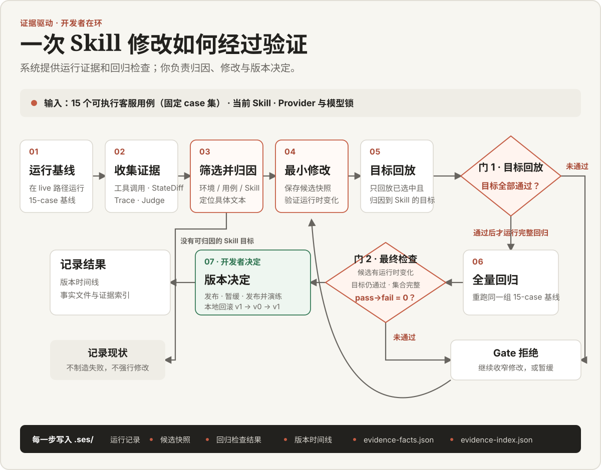
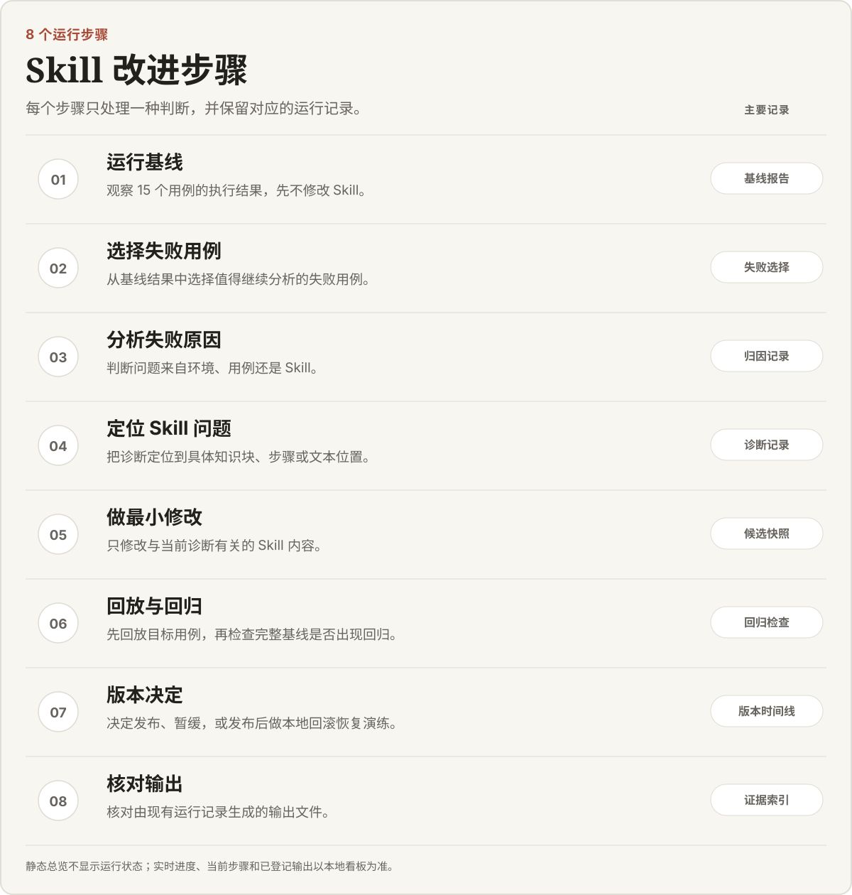

# Learn Self-Evolving Skills

这是一个用可执行评测改进 Agent Skill 的开源实战仓库。

它解决一个具体问题：几段看起来不错的对话，不能证明 Skill 真正修复了问题，也看不出是否破坏了原有能力。仓库会记录模型的工具调用和环境状态，按最终结果判分；你修改 Skill 后，再用目标回放和全量回归检查结果。

## Skill 自进化 Pipeline

这里的“自进化”不是模型自动修改自己。系统提供运行证据和回归检查；你负责归因、修改 Skill，并决定发布、暂缓，或在发布后做本地回滚恢复演练。

[](docs/assets/skill-evolution-pipeline.svg)

## 适合谁

这个项目适合已经写过简单 Agent、了解函数调用（function calling）或 MCP，并能使用 shell 和 coding agent 的开发者。

你不用重写评测引擎，也不用实现仓库里的 Python 管道。你主要做三件事：选择值得分析的失败、定位 Skill 问题、根据回归证据决定继续修改还是发布。

## 三步开始

开始前，你需要：

- Python 3.11+
- [`uv`](https://docs.astral.sh/uv/)
- Claude Code 2.1.220，用作实验执行引擎
- Claude Code、Codex 或其他兼容 Agent Skills 的 coding agent，用于加载讲师 Skill
- SiliconFlow 或 ChatAnywhere 的 API Key

使用 Claude Code 时，同一个工具可以同时承担实验执行和讲师两个角色。实时评测会调用你选择的 Provider，可能产生费用；仓库不会自动选择 Provider，也不会根据预算自动停止。

### 1. 安装

```bash
git clone https://github.com/TangWiki-Ai/learn-self-evolving-skills.git
cd learn-self-evolving-skills
uv sync --no-dev --locked
```

### 2. 设置一个 Provider Key

二选一。终端不会回显你粘贴的内容；粘贴 Key 后按回车。Key 只放在当前 shell 的环境变量中，不要粘进聊天，也不要直接写进命令、shell history、仓库或配置文件。

```bash
read -rs SILICONFLOW_API_KEY
export SILICONFLOW_API_KEY
# 或
read -rs CHATANYWHERE_API_KEY
export CHATANYWHERE_API_KEY
```

### 3. 开始学习

在 coding agent 中打开仓库，然后说：

```text
开始学习
```

项目级讲师 Skill 会检查环境、询问你使用哪个 Provider、启动本地看板，并带你完成当前步骤。新工作目录的第一条实时命令会明确写出 Provider：

```bash
uv run ses journey station 0 --provider siliconflow
# 或
uv run ses journey station 0 --provider chatanywhere
```

## 它如何工作

仓库把这套流程拆成 8 个运行步骤。每个步骤只处理一种判断，并保留对应记录：

[](docs/assets/skill-improvement-steps.svg)

回归检查先验证目标用例；只有目标全部通过，才会检查完整基线。原先通过的用例不能出现 `pass→fail`。

如果当前模型没有暴露可归因的失败，流程会记录这一事实，不会为了演示而伪造失败或回归检查拒绝。

## 你会得到什么

核心结果是 `.ses/` 下可回查的运行记录：基线报告、失败选择、归因记录、候选修改、回归检查结果和版本时间线。最后一步会生成两份核心文件：

- `evidence-facts.json`
- `evidence-index.json`

如果你需要整理或说明这次工作，还可以使用以下辅助文件：

- `resume-zh.md` 和 `resume-en.md`
- `interview-prep.md`
- `concepts.md`

这些文件只引用已有运行记录。缺少完整回归、发布或实时证据时，输出会明确标记当前状态，不会补造数字。

## 本地看板与恢复

```bash
uv run ses journey dashboard
```

本地看板默认打开 `http://127.0.0.1:8765/`，展示当前步骤、运行状态和已登记输出。它不执行命令，不写文件，不读取 Key，也不访问外网。

中断后保留 `.ses/`，再次说“开始学习”即可继续。已有工作目录会沿用保存的 Provider 和模型锁；不要切换 Provider。回归检查未通过也不妨碍你整理当前运行记录。

如需手动操作，可以查看命令帮助：

```bash
uv run ses journey --help
```

如果网络必须经过代理，请在运行前设置标准的 `HTTPS_PROXY`、`HTTP_PROXY` 或 `ALL_PROXY` 环境变量。

## 证据与边界

- 学习者路径使用实时 Claude Code 和你明确选择的 Provider。`--mode fixed` 只供仓库 CI 使用，不能代表实时模型成绩。
- 可执行客服用例来自固定的 STATE-Bench 环境。ABCD 提供语言和意图素材，tau2-bench 只提供去重与难度信号；这些资料都不是生产日志。
- State Judge 和 Rule Judge 检查工具顺序、精确参数和最终状态；模型不能自行宣布通过。
- 所有 Key 只从进程环境读取。系统会在写入 JSON、HTML、Markdown、决策或候选前检查敏感内容。
- 本地看板只提供本机只读访问，并拒绝目录穿越、符号链接逃逸和未登记文件。
- 项目不保证一次运行一定出现失败、产生提升或通过回归检查。

Provider、模型锁和费用语义见[基础运行时 Spec](docs/specs/01-foundation-runtime.md)。完整的 8 步路径与 live/fixed 规则见[交付 Spec](docs/specs/06-course-delivery.md)。

## 维护者

默认检查使用 fixed fixture 和 fake engine，不访问网络，也不读取付费 Key：

```bash
uv sync --locked
uv run ruff format --check .
uv run ruff check .
uv run mypy src tests scripts
uv run pytest
```

live smoke 必须显式选择 Provider、设置匹配的 Key，并单独授权运行。测试入口见 [`tests/engines/test_live.py`](tests/engines/test_live.py)。不要把跳过的 live smoke、fixed 结果或费用估算写成真实 Provider 结论。

## License

代码使用 [Apache-2.0](LICENSE)。上游数据保留各自的许可证与来源记录。
