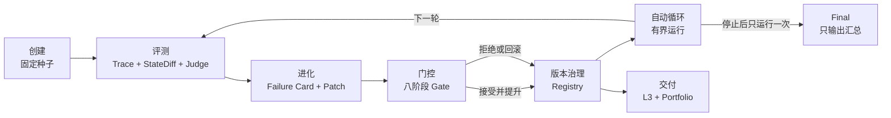

# Learn Self-Evolving Skills

> 一门项目制 Python 课程。你会从可重放评测开始，亲手构建一个能根据失败证据改进、经过 Gate 验证、支持版本晋升与回滚的 Skill 进化系统。

10 课 · Python 3.11+ · Offline-first · 首次体验不需要 API Key

[进入课程网站](https://tangwiki-ai.github.io/learn-self-evolving-skills/) · [从第 1 课开始](course/ch01-see-the-difference/README.md) · [5 分钟离线体验](#5-分钟离线体验) · [先看成品](#先看成品) · [当前状态](#当前状态)

## Skill 看起来变好了。证据在哪里？

你让 Agent 修改一个 Skill。它写得更完整，也显得更聪明了。但它真的变好了吗？

它可能只修复了刚看过的样例，也可能破坏原本能完成的任务。评测中断后，你可能无法继续；版本退化时，你也可能说不清哪里出了问题。

如果你不能重放同一批任务、检查真实终态、校准 Judge、隔离留出集，并把每处修改连回失败证据，你做的仍是试错，不是工程。

这门课带你亲手搭出完整链路：

```text
create → eval → evolve → gate → registry → auto-evolve → portfolio
```

课程使用一个可执行的电商退货场景贯穿十课。你不只会写出一个 Skill，还会建立一套判断它是否进步、何时拒绝修改、如何安全回滚的系统。

## 完成后你能做什么

完成十课后，你可以：

- 建立可重放、可恢复的 Skill 评测基线。
- 用终态、Trace 和 StateDiff 判断 Agent 是否真的完成任务。
- 组合并校准 State、Rule、LLM 和 Agent Judge。
- 从 benchmark 数据构建可审计的 develop case，同时保护 selection 和 final。
- 把失败证据转成可审核、可追踪的候选 Patch。
- 用 Gate 和 Registry 管理接受、拒绝、版本晋升与回滚。
- 运行有停止条件的自动进化循环，并导出 L1/L2/L3 报告和作品集。

## 系统如何工作



系统把修改流程和裁判分开。候选版本不能自行宣布成功；它必须通过锁定协议、受保护数据和保守 Gate。每次接受、拒绝和回滚都会留下可重放记录。

## 先看成品

课程网站提供三份面向学习者的报告摘要。它们只保留理解课程所需的信息，不公开原始运行材料、受保护数据或维护记录。

| 报告 | 它回答的问题 | 入口 |
| --- | --- | --- |
| L1 baseline | Agent 在 baseline 中做了什么，终态为什么通过或失败？ | [阅读 L1 学习摘要](https://tangwiki-ai.github.io/learn-self-evolving-skills/reports/level-1) |
| L2 配对比较 | 安装 Skill 前后，哪些 case 改善或退化？ | [阅读 L2 学习摘要](https://tangwiki-ai.github.io/learn-self-evolving-skills/reports/level-2) |
| L3 进化过程 | 哪些候选被接受或拒绝，版本如何演进？ | [阅读 L3 学习摘要](https://tangwiki-ai.github.io/learn-self-evolving-skills/reports/level-3) |

这些是 fixed/offline 教学参考。它们帮助你理解协议和证据结构，不代表 live 模型的实际效果。

## 5 分钟离线体验

你需要 Python 3.11+ 和 [`uv`](https://docs.astral.sh/uv/)。下面的路径不会读取 Key，也不会访问模型服务。

先安装依赖并运行一个固定 case：

```bash
uv sync --all-extras --locked
uv run ses run-case --output-root .ses/readme-quickstart --json
```

然后运行两轮 fixed 自动进化。流程会演示一次接受、一次拒绝，并在循环停止后运行一次 fixed final：

```bash
uv run ses auto-evolve --mode fixed --output-root .ses/readme-auto-evolve --json
```

第一次体验时，重点看三件事：

1. 评测如何把回复、工具调用和最终状态分开记录。
2. Gate 为什么拒绝看似合理但没有带来改进的候选。
3. Registry 如何保留完整版本谱系，而不是覆盖旧版本。

## 学习路径

课程按顺序推进。每个阶段都以前一阶段留下的证据为输入。

```text
阶段一：看见与判分       第 1–2 课   对照运行 → 终态与轨迹判分
阶段二：让评测可信       第 3–4 课   Judge 校准 → 可恢复 baseline
阶段三：从数据创建 v0    第 5–7 课   数据管线 → 题目验证 → Skill v0
阶段四：有证据地进化     第 8–10 课  Failure Card → Gate → 自动循环
```

每课都提供讲义、starter、solution 和参考结果。建议你先读“困惑”和“方法”，再实现 starter，最后检查报告中的证据，而不是直接复制 solution。当前 tests 用于维护课程基线，不能判断你是否完成 starter；我们正在补学习者测试入口。

## 十课目录

| 课 | 核心问题 | 你会动手做什么 | 主要产物 |
| --- | --- | --- | --- |
| [01](course/ch01-see-the-difference/README.md) | Skill 是否真的带来差异？ | 对同一任务运行无 Skill / 有 Skill 对照 | [Comparison Artifact](course/ch01-see-the-difference/comparison-artifact.json) |
| [02](course/ch02-grade-terminal-state/README.md) | 怎样从结果而不是措辞判分？ | 检查终态、Trace 和 StateDiff | [Baseline Result](course/ch02-grade-terminal-state/baseline-results.json) |
| [03](course/ch03-calibrate-judges/README.md) | 怎样知道 Judge 值得信任？ | 校准四类 Judge 并测量一致性 | [Agreement Experiment](course/ch03-calibrate-judges/agreement-experiment.json) |
| [04](course/ch04-reproducible-baseline/README.md) | 怎样得到可恢复的 baseline？ | 串联 Evaluator、Runner 和报告 | [Baseline Comparison](course/ch04-reproducible-baseline/baseline-comparison.json) |
| [05](course/ch05-mine-benchmark-data/README.md) | 怎样把 benchmark 变成候选案例？ | 固定来源，完成清洗、聚类和分层 | [Data Funnel](course/ch05-mine-benchmark-data/full-funnel-reference.json) |
| [06](course/ch06-verify-develop-cases/README.md) | 怎样让 LLM 帮忙出题但不写答案？ | 运行 qualification、oracle 和 replay | [Qualification Funnel](course/ch06-verify-develop-cases/qualification-funnel.json) |
| [07](course/ch07-create-v0/README.md) | 怎样从成功轨迹创建 Skill v0？ | 运行静态检查、触发评测和配对比较 | [L2 Report](course/ch07-create-v0/artifacts/l2.html) |
| [08](course/ch08-evidence-linked-candidate/README.md) | 怎样让修改理由可追溯？ | 从 Failure Card 生成证据链接 Patch | [Candidate Patch](course/ch08-evidence-linked-candidate/artifacts/evidence-linked-patch.json) |
| [09](course/ch09-gate-and-govern-versions/README.md) | 什么时候接受、晋升版本或回滚？ | 实现 Gate 与 Registry 治理 | [GateDecision](course/ch09-gate-and-govern-versions/artifacts/fixed-accept-promote-rollback/gates/gate-reference-accept/gate-decision.json) |
| [10](course/ch10-auto-evolve-and-portfolio/README.md) | 怎样安全运行多轮进化？ | 运行有界循环并导出结果 | [L3 + Portfolio](course/ch10-auto-evolve-and-portfolio/artifacts/fixed-reference/) |

具体命令、实现边界和检查方式写在每课 README 中。

## 这门课适合谁

这门课适合你，如果你：

- 会使用 Python、终端、Git 和测试工具。
- 已经写过简单 Agent，并理解 function calling 或 MCP 的基本概念。
- 正在开发 Agent、Skill、评测系统或质量控制流程。
- 关心结果是否可复现、可解释、可回滚。

这门课不适合你，如果你：

- 想找一门零代码的 AI 入门课。
- 只想复制几段 Prompt，不准备运行代码和测试。
- 需要一个已经托管好的成品服务。
- 希望用仓库中的固定示例直接证明真实模型效果。

## 课程为什么这样设计

- **先看见，再测量，最后优化。** 第 1 课先展示差别；第 2–4 课建立可信测量；后续课程才开始生成和进化 Skill。
- **能用状态和规则判断，就不让模型猜。** LLM Judge 只处理确定性证据无法回答的语义问题。
- **修改者看不到留出答案。** Creator 和 Updater 不能读取 selection、final、gold 或逐题反馈。
- **平局也拒绝。** Gate 只接受有证据的改进，不把“没有更差”当作成功。
- **自动化不绕过治理。** 自动循环复用同一个 Gate 和 Registry，并受停止条件约束。

## 数据与证据边界

课程使用 benchmark 和角色扮演数据，不使用生产日志，也不把它们描述成真实生产流量。

| 数据源 | 在课程中的作用 |
| --- | --- |
| [STATE-Bench](data/upstream/state_bench/SOURCE.md) | 提供可执行的电商任务和固定环境 |
| [ABCD](data/upstream/abcd/SOURCE.md) | 提供自然表达、意图和清洗练习 |
| [tau2](data/upstream/tau2/SOURCE.md) | 提供去重与难度分层信号 |

公开仓库只保存课程需要的固定切片、来源记录和聚合证据。受保护的 selection/final 身份、答案和逐题材料不进入 Git。详细设计见[测试集规格](docs/specs/05-testset-pipeline.md)和[跨模块契约](docs/specs/10-cross-module-contracts.md)。

## 当前状态

| 内容 | 状态 |
| --- | --- |
| 十课讲义、starter、solution 和参考结果 | 已提供 |
| Fixed/offline 演示路径 | 可运行 |
| 验证 starter 的学习者测试 | 尚未提供；当前 tests 只维护课程基线 |
| [课程网站](https://tangwiki-ai.github.io/learn-self-evolving-skills/) | 已提供 |
| Live 端到端路径 | 尚未完成 |

Live 路径尚未完成，集中人工复核也待签署。因此，仓库中的 fixed 报告只证明流程和证据结构可以工作，不能替代 live 模型成绩。维护者需要的运行记录和完整偏差清单统一放在[首发验证报告](docs/release/release-report.md)。

## 仓库结构

```text
course/              十课讲义、starter、solution、tests 和参考结果
src/ses/             评测、数据、Skill、进化、治理和报告实现
tests/               模块、契约、集成与发布验证
data/                固定课程数据、来源和公开 manifest
docs/specs/          系统与课程规格
docs/release/        发布验证、人工复核与已知偏差
scripts/             数据准备、参考结果和 clean-room 验证工具
website/             课程网站、学习进度与公开信息检查
```

## 文档

- [产品需求](docs/product/prd.md)
- [系统规格](docs/specs/README.md)
- [课程交付规格](docs/specs/09-course-delivery.md)
- [本地发布验证](docs/release/README.md)
- [首发验证报告](docs/release/release-report.md)
- [课程体验对齐研究](docs/research/learn-harness-engineering-alignment.md)

## 许可

课程代码使用 [Apache-2.0](LICENSE)。上游数据保留各自的许可证、固定版本和来源记录。
