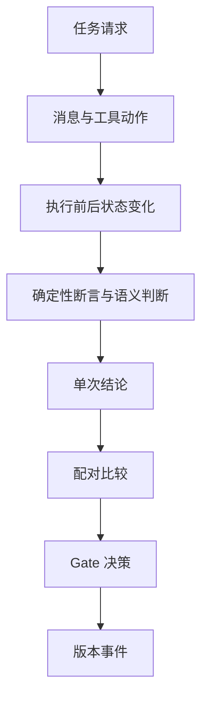

# 证据阅读指南

“Skill 变好了”不是证据。它只是一个需要验证的主张。

## 一条完整证据链

每一层都只能根据前一层已经保存的事实工作。报告不能重新判分，Updater 不能修改 Judge，候选也不能读取受保护留出材料。

## 主张与最低证据

| 你想说什么 | 你至少需要什么 |
| --- | --- |
| Agent 完成了任务 | fresh Trace、执行前后状态、关键工具证据和断言 |
| Skill 带来了改善 | 同任务、同协议、独立环境下的 fresh 配对比较 |
| 候选值得接受 | 静态检查、触发检查、受保护 selection 比较和回归检查 |
| 当前版本可追溯 | 不可变版本内容、Gate 决策和连续 Registry 事件 |
| 自动循环安全停止 | 每轮意图与完成记录、停止条件、当前版本和一次 final 汇总 |

## 先相信确定性证据

能由代码和环境直接判断的事实，不交给语义 Judge 猜：

- 业务状态是否真的改变。
- 工具是否调用，参数与顺序是否正确。
- 运行是否使用 fresh workspace。
- 候选是否只修改允许的文件。
- Registry 是否保留了完整事件顺序。

语义 Judge 只处理这些证据无法回答的问题，例如最终回复是否清楚解释了实际结果。

## 区分三种“没有通过”

- **任务失败：** Agent 没有完成任务，证据充分。
- **证据不足：** 当前材料无法支持通过或失败。
- **评测问题：** Judge、输入协议或运行过程本身出了问题。

把三者混成一个失败标签，会让 Updater 修错对象。环境问题不应该变成 Skill 补丁，Judge 问题也不应该进入失败归因。

## 公开与受保护边界

公开学习材料可以展示：

- 聚合结果与变化分类。
- 脱敏后的失败类别。
- 接受、拒绝、晋升和回滚关系。
- 当前版本的公开内容与架构说明。

公开学习材料不会展示：

- selection 和 final 的任务身份、答案或逐题反馈。
- 修改者无权读取的 Judge 私有材料。
- 凭据、本机路径和原始服务响应。
- 能让下一轮针对留出题调参的细节。

## 检查一项改进声明

看到“改进”时，依次问：

1. 比较两侧是否使用同一批任务和同一协议？
2. 两侧是否都从 fresh 环境开始？
3. 结论能否回到 Trace、状态和断言？
4. 报告是否同时展示改善与退化？
5. 修改是否能连回具体失败证据？
6. Gate 是否独立于修改流程？
7. 留出材料是否对 Creator 和 Updater 隐藏？

只要其中一个答案含糊，就不要下“已经变好”的结论。

[用 L1/L2/L3 练习阅读证据](/reports/) · [查看课程路径](/course/)
